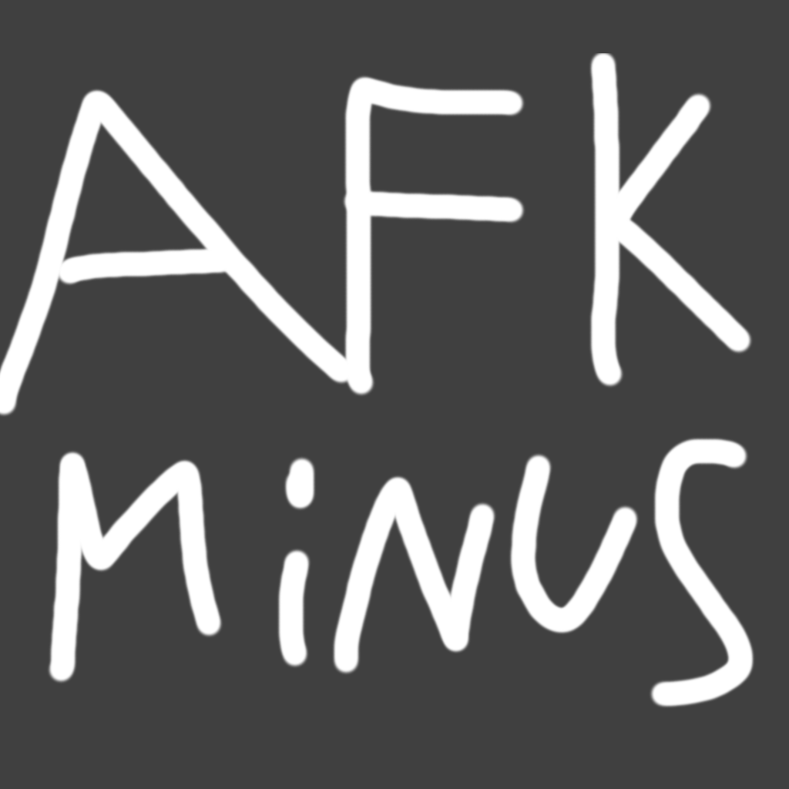

<h1 align="center">AfkMinus</h1>

<p align="center">
    
</p>

## This is a pretty simple fabric mod that adds a configurable placeholder for players that haven't moved in a while, inspired by the [AfkPlus](https://modrinth.com/mod/afkplus) mod

** **
## Placeholder

### This mod adds a placeholder that you can use along other mods like [Styled Playerlist](https://github.com/Patbox/StyledPlayerList) and [Styled Chat](https://github.com/Patbox/StyledChat):
###### *Placeholders can be changed in the [config](#config) or with the command /afkminus set \<config option\> \<value\>*
 - `%afkminus:afk%` *(Placeholder for players who haven't sent an input in **time_until_afk** seconds)*

** **
## Config

The `afk_placeholder` config values use [Simplified Text Format](https://placeholders.pb4.eu/user/text-format/)

#####  To reload the config in game, use the command `/afkminus config reload`
*Example & default config, file located here: `./config/AfkMinus.json`*
```json
{
    "config_version_DO_NOT_TOUCH": "1.0.1",
    "afk_placeholder": "<i><dark_gray>[<gray>AFK</gray>]</dark_gray></i> ",
    "time_until_afk": 300, 
    "add_tag_on_afk": true,
    "tag_on_afk": "afkminus.afk"
}
```

** **
## Commands

##### This mod adds 1 command with 5 subcommands detailed below
*(Permissions required detailed in the [Permissions](#Permissions) section)*

`/afkminus config reload` *- Reloads the config from the file*<br>
`/afkminus config set <key> <value>` *- Changes the config from in game, reload not needed*

`/afkminus force <player(s)>` *- Forces the players given to be marked as afk, removed on player input*<br>
`/afkminus reset <player(s)>` *- Resets the last input time and forced afk status*

`/afkminus getstatus <player>` *- See the afk status of a player (afk, time, forced or not, by who)*<br>
Additionally, you can use it for command blocks/datapacks like so `/execute store result score <...> run afkminus getstatus <player>`, if player is afk the score will be set to 0 and 1 if the player is afk


** **
## Permissions
Base command (`/afkminus`) requires `afkminus.command.afkminus.base` or at least permission level 2 to see/use sub commands
Sub-Base command (`/afkminus config`) requires `afkminus.command.afkminus.config.base` or at least permission level 4 to see/use sub commands
Sub-Base command (`/afkminus config set`) requires `afkminus.command.afkminus.config.set.base` or at least permission level 4 to see/use sub commands

`/afkminus config reload` - `afkminus.command.afkminus.config.reload` || Permission level 4<br>
`/afkminus config set <key> <value>` - `afkminus.command.afkminus.config.set` || Permission level 4<br>
    **- Can be additionally restricted with `afkminus.command.afkminus.config.set.<config_value>`, for example with `afkminus.command.afkminus.config.set.time_until_afk`, a player can only edit the time until afk**


`/afkminus force <player(s)>` - `afkminus.command.afkminus.force` || Permission level 2<br>
`/afkminus reset <player(s)>`- `afkminus.command.afkminus.reset` || Permission level 2

`/afkminus getstatus <player>` - `afkminus.command.afkminus.getstatus` || Permission level 2

** **
### Known issues/oddities
#### Carpet Shadowed players not being added to the afk playerlist due to their joining order, leading them to be imcompatible with the mod
#### Carpet shadowed players and Players respawning will trigger a warning "player already exists in the list?", this can safely be ignored
